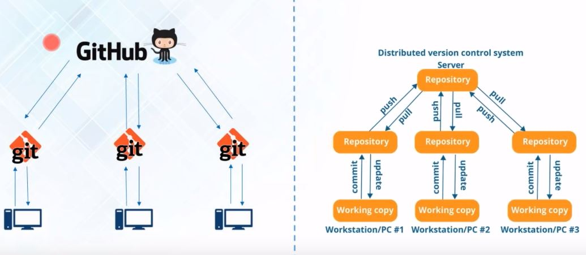
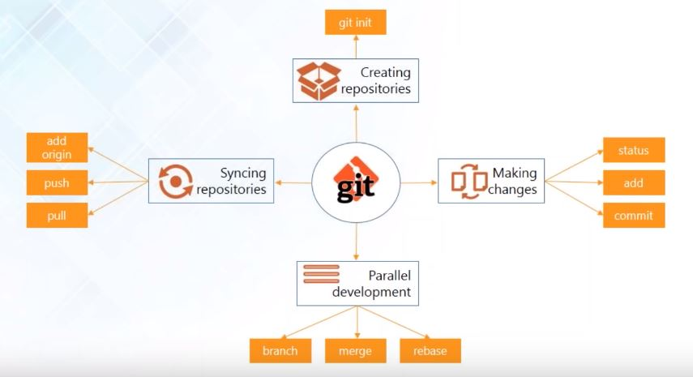
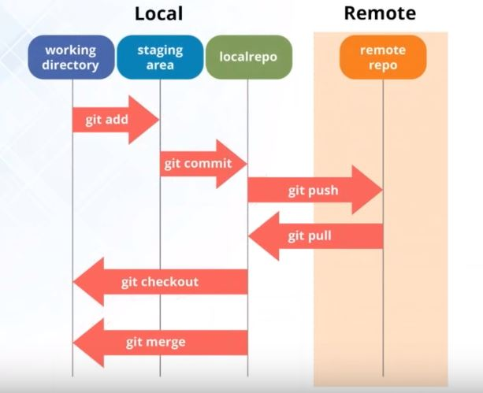

# Git-tutorial
Learning how to use git for version control with central repositories over github. 

Version Control:
Version control is the management of changes to documents, computer programs, large websites and other information.

These changes are usually termed as versions. 

It creates a snapshot of the entire project and saves it, every time any changes are made to project.

The changes might be adding a new file or modifying the older files by changing the source code. 

Snapshots are termed as different versions.

Snapshot is the state of the project at a particular time. 

In case if the central server crashes, a backup is always available in the local servers.

VCS (Version Control System) provides information on what was changed and when it was changed which helps in analyzing the project evolution between versions.

VCS tools: 
-	Git (Distributed VCS)
-	Subversion (SBN) (Apache)
-	CVS (Concurrent version system)
-	Mercurial (Distributed)

Subversion and CVS are decentralized VC tools. They do not provide developers with a local copy. All the collaborators are working directly with central repository only. 

Git is a VC tool which allows to fetch data from central server, push the local files into central servers. 

GitHub is a hosting platform for VC collaboration. Allows to host the central repository in a remote server. 

Distributed VCS provides backup and speed. You don’t have to always travel over network to get access to all the files. 

We can automate the operations of push and pull by using a job schedular or crontab. This has a disadvantage that, if you have not worked on a particular file and you have a job schedular, it will automatically push the unfinished work. 

The advantage of distributed VCS is that you can work in isolation and whenever you are sure that your code is working fine, then you can push it on GitHub. 

Uses Lossless compression technique to compress data on client side. 

In event of a system crash, the lost data can be easily recovered from any of the local repositories of collaborators.

Repository:
A directory or storage space where projects can live. It can be local to a folder on a computer or it can be storage space on GitHub or another online host. 
 

Create a local repository.
-	Run git init in the bash.

Synching repos:
Synch the local repo with a remote repo.
-	git remote add origin “https://github.com/Ruturaaj9/Git-tutorial.git”

Fetching the files from central repo (pulling)
-	git pull origin master

git status to see if there are any files to be committed to the local repo.

git add to add files to index folder to commit.

Adding multiple files: git add -A

Committing files to local repo:
-	git commit
-	git commit -a -m “adding files to local repo”
-	a to commit all added files.

git log to see the commits made. 

Parallel development- Branching
-	Branches are pointers to a specific commit.
-	Two types: local branch, remote-tracking branch.
-	git branch firstbranch
-	switching to branch: git checkout firstbranch

Merging: 
-	Combining the work of different branches together.
-	Allows to branch off, develop a new feature and combine it back in.
-	git merge firstbranch : firstbranch will be merged into master

Rebasing:
-	Same as merging but makes the commits in a linear way.
-	git rebase firstbranch
-	used for making linear sequence of commits.

Pushing the changes in central repository:
-	creating a ssh key: ssh-keygen
-	copy the key and add it to github
-	do ssh -T git@github.com
-	git push origin firstbranch
-	git push origin master

Reverting back to previous versions:
-	check the git log and select the version you want to revert to and copy the first 8 characters of the hash.
-	Then do: git checkout copied-characters filename

